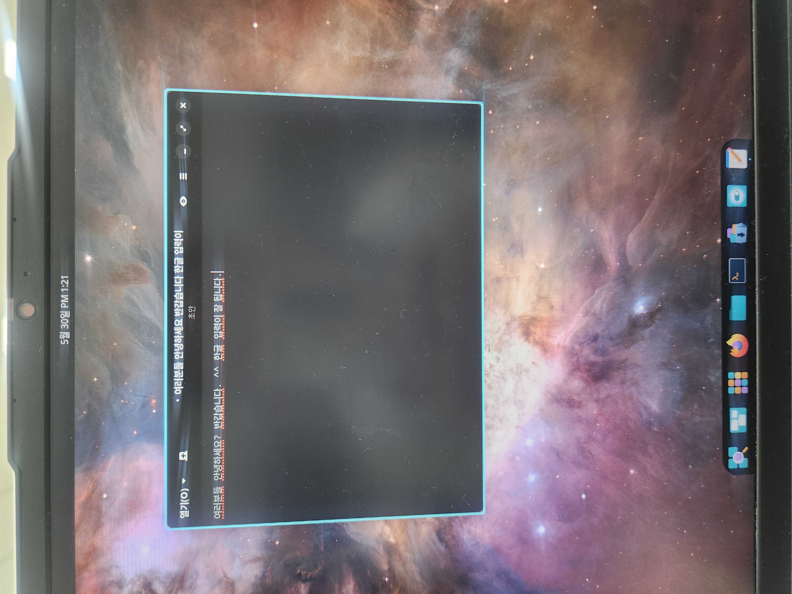

<div align="center">



# Cosmic OS · Korean Edition

### Korean input **and** a Korean UI that work **out of the box** on Pop!_OS 24.04 **COSMIC (Wayland)**

**Plug in one USB, boot, done. No install, no manual keyboard setup.**

[🇰🇷 한국어 README →](README.md)

</div>

---

# ✅ What works

| | Feature |
|---|---|
| **Korean input** | Type Hangul in COSMIC (Wayland) editors, terminals, apps — via fcitx5 5.1.12 |
| **Korean UI** | Menus · buttons · dates all in Korean (ko_KR.UTF-8) |
| **5 toggle keys** | Both Windows and Mac users get the keys they already know |
| **No install** | Boot from USB only. Ventoy persistence keeps your settings |

---

# 📥 Download

**[→ Get the ISO from Releases](https://github.com/Hostingglobal-Tech/cosmic-os-korean/releases/latest)**

The 3.4GB ISO is split in two (GitHub's 2GB limit). **Download both parts and join them:**

- **Windows**: `copy /b cosmic-os-korean.iso.part00 + cosmic-os-korean.iso.part01 cosmic-os-korean.iso`
- **Linux/macOS**: `cat cosmic-os-korean.iso.part0* > cosmic-os-korean.iso`

Verify (SHA-256): `3c57f60f515d156f06c5756137b450e38ddd9176b21fcfdda0abe8100884cb5b`

---

# 🤔 Why this exists

Korean input on Linux is notoriously inconsistent — it varies by distro, desktop, and input-method version. **Pop!_OS 24.04’s new COSMIC desktop** is a young Wayland compositor, so Korean **does not work out of the box.**

The usual advice is *“switch to an X11 session”* or *“use another distro.”* That’s **avoidance, not a fix** (and X11 is going away).

**This project keeps COSMIC as-is and makes Korean work on Wayland.**

- ❌ **ibus** — does not deliver Hangul to apps on COSMIC (shipped version too old)
- ✅ **fcitx5 5.1.12** — connects to COSMIC’s Wayland input-method → **Hangul composes**

---

# ⌨️ Toggle keys (Windows / Mac)

After boot, click a text field and press **any** of these to switch Korean ↔ English:

| Toggle key | Windows | Mac |
|:---|:---:|:---:|
| **Hangul key** (right of space) | ✅ recommended | — |
| **Right Alt** | ✅ | — |
| **Caps Lock** | ✅ | ✅ **recommended** (familiar on Mac) |
| **Shift + Space** | ✅ | ✅ |
| **Ctrl + Space** | ✅ | ✅ |

> Windows users: the **Hangul key** is easiest. Mac users: **Caps Lock**. Both are pre-configured.

---

# 🚀 Getting started

## 🪟 Windows users

1. **USB** — 8GB or larger
2. **[Ventoy](https://www.ventoy.net/)** — install once to the USB (free tool that makes USBs bootable)
3. **Copy the ISO** — drop `Cosmic_OS_Korean.iso` onto the USB
4. **(Optional) Save settings** — add a Ventoy persistence file to keep Wi-Fi / logins / Korean config
5. **Boot** — press `F12` / `ESC` / `F2` at power-on → pick the USB
6. **Type Korean** — click a text editor → **Hangul key** → type

## 🍎 Mac users

1. **USB** — 8GB or larger
2. **[Ventoy](https://www.ventoy.net/)** — flash the USB
3. **Copy the ISO** — `Cosmic_OS_Korean.iso`
4. **Boot** — hold `Option (⌥)` at power-on → pick the USB (Intel Macs)
5. **Type Korean** — click a text editor → **Caps Lock** → type

---

# 💬 FAQ

**Q. Does Korean really work on COSMIC — not GNOME?**
> Yes, **stock COSMIC (Wayland)**. The screenshot above is the COSMIC desktop. fcitx5 5.1.12 attaches to COSMIC’s input-method and composes Hangul.

**Q. Do I need to install it?**
> No. **Just boot from USB.** Your computer’s disk is untouched.

**Q. Do settings reset on reboot?**
> Live-only resets. Add a **Ventoy persistence file** to keep Wi-Fi / logins / Korean config permanently.

**Q. The toggle key doesn’t work.**
> Click (focus) the text field first, then press it. If still stuck, run `fcitx5 -d --replace` in a terminal.

**Q. Why fcitx5 instead of ibus?**
> On COSMIC, ibus fails to deliver Hangul to apps. fcitx5 **5.1.12+** connects properly to COSMIC’s Wayland input-method protocol.

**Q. Wouldn’t Mint/Zorin be easier?**
> Those run X11, so they work out of the box. The point here is to prove **it works on COSMIC too.**

---

# 🛠 Build it yourself

Remaster the Pop!_OS 24.04 COSMIC ISO. (Needs Linux + `xorriso` + `squashfs-tools`.)

```bash
sudo bash build-fcitx5.sh      # fcitx5 + ko locale + hangul profile
sudo bash build-hotkeys.sh     # 5 toggle keys + robust autostart
# → pop-cosmic-korean-final.iso
```

Key changes:
- Upgrade `fcitx5` to **5.1.12** from plucky (25.04) — the version COSMIC Wayland needs
- IM env `GTK_IM_MODULE=fcitx` · `XMODIFIERS=@im=fcitx`
- fcitx5 profile `DefaultIM=hangul` + 5 toggle keys
- Korean locale `ko_KR.UTF-8` + language packs
- Autostart on boot (systemd user service + XDG autostart)

---

# 📜 License

[Apache-2.0](LICENSE) — fork and customize freely.
