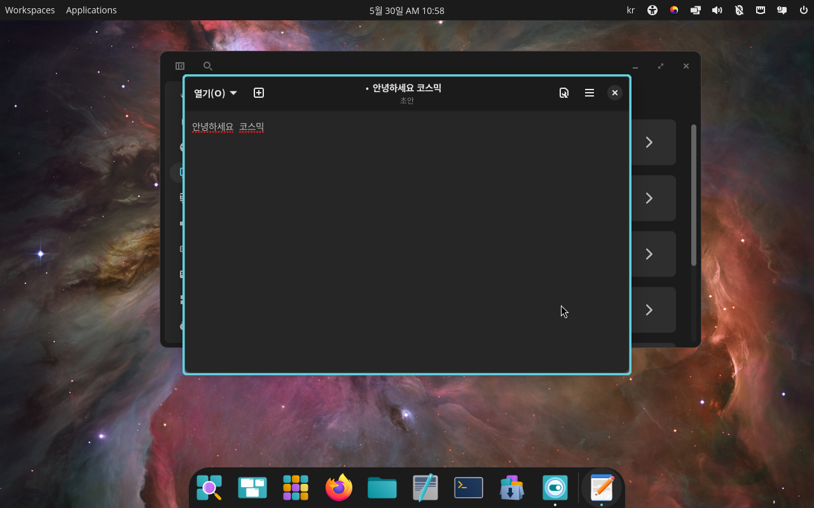

<div align="center">


# Cosmic OS · 한글판

### Pop!_OS 24.04 **COSMIC (Wayland)** 에서 한글 입력과 한글 화면이 **바로** 되는 라이브 OS

**USB 하나 꽂고 부팅하면 끝. 설치도, 키보드 추가 설정도 필요 없습니다.**

[🇺🇸 English README →](README.en.md)

</div>

---

# ✅ 무엇이 되나요

| | 기능 |
|---|---|
| **한글 입력** | COSMIC(Wayland) 텍스트 편집기·터미널·앱에서 한글 타이핑 (fcitx5 5.1.12) |
| **한글 화면(UI)** | 메뉴 · 버튼 · 날짜 전부 한국어 (ko_KR.UTF-8) |
| **한영 전환키 5종** | 윈도우 · 맥 사용자 모두 평소 쓰던 키 그대로 |
| **설치 불필요** | USB 부팅만. Ventoy persistence 로 설정 영구 저장 |

---

# 📸 진짜 되는 증거

<div align="center">

</div>

COSMIC 텍스트 편집기에 **「안녕하세요 코스믹」** 조합 입력 성공. (사진은 가상머신 검증 화면)

---

# 🤔 왜 만들었나

리눅스 한글 입력은 **배포판·데스크탑·입력기 버전마다 제각각**이라 개발자도 헤맵니다. 특히 **Pop!_OS 24.04 의 새 데스크탑 COSMIC** 은 Wayland 기반 신생이라, 기본 상태로는 한글이 **안 됩니다.**

흔한 조언은 *"X11 세션으로 도망쳐라"*, *"다른 배포판 써라"* 입니다. 하지만 그건 **해결이 아니라 회피**입니다. (게다가 X11 은 점점 사라지는 중)

**이 프로젝트는 COSMIC 을 그대로 두고, Wayland 위에서 한글을 뚫었습니다.**

- ❌ **ibus** — COSMIC 에서 앱에 한글이 전달 안 됨 (입력기 너무 구버전)
- ✅ **fcitx5 5.1.12** — COSMIC Wayland 의 input-method 에 정상 연결 → **한글 조합 성공**

---

# ⌨️ 한영 전환키 (윈도우 / 맥 모두)

부팅 후 입력란을 클릭하고 아래 키 **아무거나** 누르면 한 ↔ 영 전환됩니다.

| 전환키 | 윈도우 사용자 | 맥 사용자 |
|:---|:---:|:---:|
| **한/영 키** (오른쪽 Alt 옆) | ✅ 권장 | — |
| **오른쪽 Alt** | ✅ | — |
| **Caps Lock** | ✅ | ✅ **권장** (맥에서 익숙) |
| **Shift + Space** | ✅ | ✅ |
| **Ctrl + Space** | ✅ | ✅ |

> 윈도우 사용자는 **한/영 키**가, 맥 사용자는 **Caps Lock** 이 가장 편합니다. 둘 다 미리 박혀 있습니다.

---

# 🚀 시작하기

## 🪟 윈도우 사용자

1. **USB 준비** — 8GB 이상
2. **[Ventoy](https://www.ventoy.net/)** 다운로드 → USB 에 한 번 설치 (USB 를 부팅 가능하게 만드는 무료 도구)
3. **ISO 복사** — `Cosmic_OS_한글판.iso` 를 USB 에 그냥 복사
4. **(선택) 설정 저장** — Ventoy persistence 파일을 함께 두면 와이파이·로그인·한글설정이 영구 저장
5. **부팅** — PC 켤 때 `F12` / `ESC` / `F2` → USB 선택
6. **한글 입력** — 텍스트 편집기 클릭 → **한/영 키** → 타이핑

## 🍎 맥 사용자

1. **USB 준비** — 8GB 이상
2. **[Ventoy](https://www.ventoy.net/)** 로 USB 굽기
3. **ISO 복사** — `Cosmic_OS_한글판.iso`
4. **부팅** — 맥 켤 때 `Option(⌥)` 키 누른 채 → USB 선택 (Intel 맥)
5. **한글 입력** — 텍스트 편집기 클릭 → **Caps Lock** → 타이핑

---

# 💬 자주 묻는 질문

**Q. 진짜 COSMIC 에서 한글이 되나요? GNOME 으로 바꾼 거 아니고요?**
> 네, **순정 COSMIC(Wayland)** 그대로입니다. 위 스크린샷이 COSMIC 데스크탑에서 찍은 겁니다. fcitx5 5.1.12 가 COSMIC 의 input-method 에 붙어서 조합합니다.

**Q. 설치해야 하나요?**
> 아니요. **USB 부팅만** 하면 됩니다. 컴퓨터 디스크는 건드리지 않습니다.

**Q. 부팅하면 설정이 사라지나요?**
> 라이브만 쓰면 재부팅 시 초기화됩니다. **Ventoy persistence 파일**을 같이 두면 와이파이·로그인·한글설정이 **영구 저장**됩니다.

**Q. 한영키가 안 먹어요.**
> 입력란을 한 번 **클릭(포커스)** 한 뒤 눌러주세요. 그래도 안 되면 터미널에서 `fcitx5 -d --replace` 한 번 실행.

**Q. 왜 ibus 가 아니고 fcitx5 인가요?**
> COSMIC 에서는 ibus 가 앱에 한글을 전달하지 못합니다(미성숙). fcitx5 **5.1.12 이상**이 COSMIC Wayland 의 input-method 프로토콜에 정상 연결됩니다.

**Q. 다른 배포판(Mint, Zorin) 쓰는 게 낫지 않나요?**
> 그것들은 X11 이라 원래 잘 됩니다. 하지만 **COSMIC 에서도 된다**는 걸 증명한 게 이 프로젝트의 핵심입니다.

---

# 🛠 직접 빌드 (개발자용)

Pop!_OS 24.04 COSMIC ISO 를 받아서 리마스터합니다. (Linux + `xorriso` + `squashfs-tools` 필요)

```bash
# 1. 원본 ISO 풀고 fcitx5 5.1.12 + 한글 설정 주입 + 재패키징
sudo bash build-fcitx5.sh      # fcitx5 + ko locale + hangul 프로필
sudo bash build-hotkeys.sh     # 한영키 5종 + autostart 견고화
# → pop-cosmic-korean-final.iso
```

핵심 적용 사항:
- `fcitx5` 를 plucky(25.04)의 **5.1.12** 로 업그레이드 (COSMIC Wayland 요구버전)
- 입력기 환경변수 `GTK_IM_MODULE=fcitx` · `XMODIFIERS=@im=fcitx`
- fcitx5 프로필 `DefaultIM=hangul` + 한영키 5종 (`Hangul` · `Alt_R` · `Caps_Lock` · `Shift+space` · `Control+space`)
- 한국어 로케일 `ko_KR.UTF-8` + 언어팩
- 부팅 자동시작 (systemd user service + autostart)

---

# 📜 License

[Apache-2.0](LICENSE) — 자유롭게 포크 · 개조하세요.
